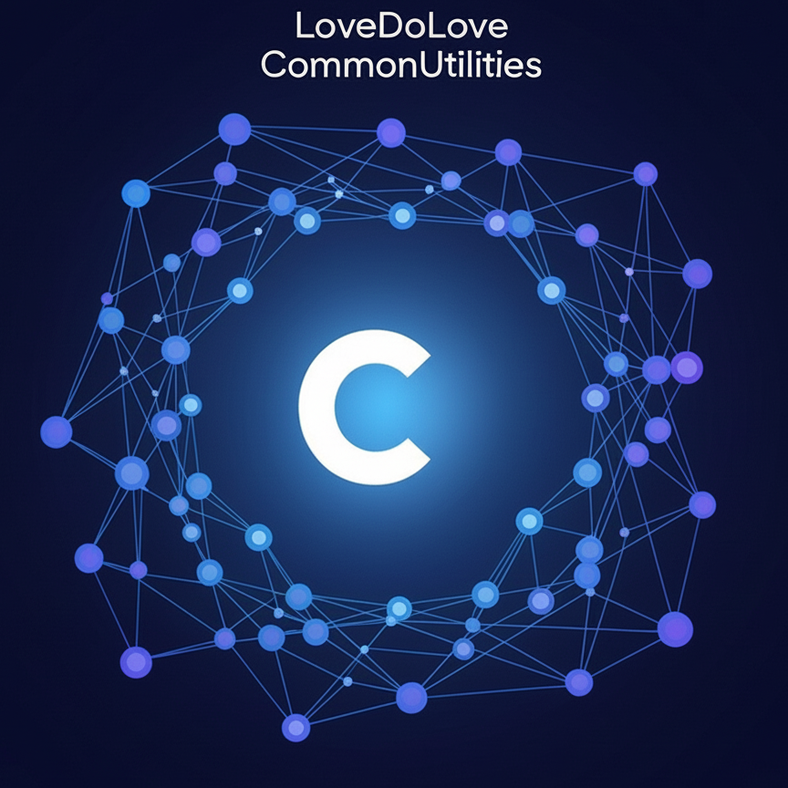

<!-- Improved compatibility of back to top link: See: https://github.com/othneildrew/Best-README-Template/pull/73 -->

<a id="readme-top"></a>

<!-- PROJECT SHIELDS -->

[![Contributors][contributors-shield]][contributors-url]
[![Forks][forks-shield]][forks-url]
[![Stargazers][stars-shield]][stars-url]
[![Issues][issues-shield]][issues-url]
[![MIT License][license-shield]][license-url]

<!-- PROJECT LOGO -->
<br />
<div align="center">
  <a href="https://github.com/LoveDoLove/CS_CommonUtilities">
    
  </a>
  <h3 align="center">CommonUtilities</h3>
  <p align="center">
    A modular, production-ready C#/.NET utility library and toolkit for rapid development.
    <br />
    <a href="https://github.com/LoveDoLove/CS_CommonUtilities"><strong>Explore the docs »</strong></a>
    <br />
    <br />
    <a href="https://github.com/LoveDoLove/CS_CommonUtilities">View Demo</a>
    &middot;
    <a href="https://github.com/LoveDoLove/CS_CommonUtilities/issues/new?labels=bug&template=bug-report---.md">Report Bug</a>
    &middot;
    <a href="https://github.com/LoveDoLove/CS_CommonUtilities/issues/new?labels=enhancement&template=feature-request---.md">Request Feature</a>
  </p>
</div>

<details>
  <summary>Table of Contents</summary>
  <ol>
    <li>
      <a href="#about-the-project">About The Project</a>
      <ul>
        <li><a href="#features">Features</a></li>
        <li><a href="#built-with">Built With</a></li>
      </ul>
    </li>
    <li>
      <a href="#getting-started">Getting Started</a>
      <ul>
        <li><a href="#prerequisites">Prerequisites</a></li>
        <li><a href="#installation">Installation</a></li>
        <li><a href="#configuration">Configuration</a></li>
      </ul>
    </li>
    <li><a href="#usage">Usage</a></li>
    <li><a href="#project-structure">Project Structure</a></li>
    <li><a href="#contributing">Contributing</a></li>
    <li><a href="#license">License</a></li>
    <li><a href="#contact">Contact</a></li>
    <li><a href="#acknowledgments">Acknowledgments</a></li>
  </ol>
</details>

<!-- ABOUT THE PROJECT -->

## About The Project

CommonUtilities is a modular, production-ready C#/.NET utility library and toolkit designed to accelerate development for .NET 8+ projects. It contains a broad set of helpers, models, and utilities for common application needs (security, data, HTTP, scheduling, media, cloud integrations, and more). The codebase is organized for easy consumption as a project reference or compiled library.

This README was created from the project's template and repository contents.

<p align="right">(<a href="#readme-top">back to top</a>)</p>

### Features

- Security: AES, SHA256, signature and related helpers
- Data: Conversion, formatting, JSON file utilities
- HTTP: Basic and advanced HTTP helpers
- System: App settings, caching, file/process utilities, logging helpers
- Scheduler: Cron job helpers, scheduled services, SyncService base
- Media: Image helpers, Dropbox/image helpers, QR code generation
- Integrations: Stripe, Cloudflare captcha, Google AI, Google Drive, Google MFA
- Mailer: SMTP/mail helpers
- Utilities: Command helpers, enum helpers, IP info lookup

<p align="right">(<a href="#readme-top">back to top</a>)</p>

### Built With

- [.NET 8.0](https://dotnet.microsoft.com/en-us/download/dotnet/8.0)
- [C#](https://learn.microsoft.com/dotnet/csharp/)

<p align="right">(<a href="#readme-top">back to top</a>)</p>

<!-- GETTING STARTED -->

## Getting Started

Use this project by referencing the `CommonUtilities` project in your solution or by building the library and consuming the DLL.

### Prerequisites

- [.NET 8.0 SDK](https://dotnet.microsoft.com/en-us/download/dotnet/8.0)

### Installation

1. Clone the repository:

```cmd
git clone https://github.com/LoveDoLove/CS_CommonUtilities.git
```

2. Restore packages and build:

```cmd
dotnet restore
dotnet build
```

3. Add `CommonUtilities\CommonUtilities.csproj` as a project reference in your solution or copy the compiled DLL from `bin/`.

<p align="right">(<a href="#readme-top">back to top</a>)</p>

### Configuration

Many helpers require configuration via `appsettings.json` (or `appsettings.Development.json`). Example configuration keys used in this repo:

```json
{
  "Smtp": {
    /* mailer */
  },
  "CfCaptcha": {
    /* cloudflare captcha */
  },
  "IpInfo": {
    /* ipinfo token */
  },
  "Stripe": {
    /* api keys */
  }
}
```

See `appsettings.json` and `appsettings.Development.json` in the repo root for concrete examples.

<p align="right">(<a href="#readme-top">back to top</a>)</p>

<!-- USAGE EXAMPLES -->

## Usage

Examples below show common usage patterns. Refer to source XML comments for full API details.

### Basic security

```csharp
using CommonUtilities.Utilities.Security;

string encrypted = AesUtilities.Encrypt("mydata", "password");
string hash = Sha256Utilities.ComputeHash("mydata");
```

### Sending email

```csharp
using CommonUtilities.Helpers.Mailer;
using Microsoft.Extensions.Configuration;

var config = new ConfigurationBuilder().AddJsonFile("appsettings.json").Build();
var smtpConfig = config.GetSection("Smtp").Get<Mailer.MailerConfig>();
var mailer = new Mailer.MailerHelper(smtpConfig);
await mailer.SendAsync("to@example.com", "Subject", "Body");
```

### Stripe (example)

```csharp
using CommonUtilities.Helpers.Stripe;

var cfg = new Stripe.StripeConfig { ApiKey = "sk_test_xxx" };
var stripe = new Stripe.StripeHelper(cfg);
// use stripe methods
```

<p align="right">(<a href="#readme-top">back to top</a>)</p>

## Project Structure

Top-level folders and a short description (see repository for full details):

- `CommonUtilities/Helpers/` — helper classes grouped by feature (Mailer, Stripe, GoogleDrive, Security, Media, etc.)
- `CommonUtilities/Models/` — shared models and constants
- `CommonUtilities/Utilities/` — lower-level utilities (Data, Http, Security, System helpers)
- `CommonUtilities/Services/` — background services and SyncService base
- `appsettings.json` / `appsettings.Development.json` — configuration samples

Use these namespaces in your projects to call the helpers directly.

<p align="right">(<a href="#readme-top">back to top</a>)</p>

## Contributing

Contributions are welcome. To contribute:

1. Fork the repository
2. Create a feature branch (`git checkout -b feature/MyFeature`)
3. Commit your changes (`git commit -m "Add feature"`)
4. Push to your branch (`git push origin feature/MyFeature`)
5. Open a Pull Request

Please follow standard .NET best practices and include unit tests where appropriate.

<p align="right">(<a href="#readme-top">back to top</a>)</p>

## License

Distributed under the MIT License. See `LICENSE` for details.

<p align="right">(<a href="#readme-top">back to top</a>)</p>

## Contact

LoveDoLove — [GitHub](https://github.com/LoveDoLove)

Project Link: https://github.com/LoveDoLove/CS_CommonUtilities

<p align="right">(<a href="#readme-top">back to top</a>)</p>

## Acknowledgments

- [Best-README-Template](https://github.com/othneildrew/Best-README-Template)
- [.NET Documentation](https://learn.microsoft.com/dotnet/)

<p align="right">(<a href="#readme-top">back to top</a>)</p>

<!-- MARKDOWN LINKS & IMAGES -->

[contributors-shield]: https://img.shields.io/github/contributors/LoveDoLove/CS_CommonUtilities.svg?style=for-the-badge
[contributors-url]: https://github.com/LoveDoLove/CS_CommonUtilities/graphs/contributors
[forks-shield]: https://img.shields.io/github/forks/LoveDoLove/CS_CommonUtilities.svg?style=for-the-badge
[forks-url]: https://github.com/LoveDoLove/CS_CommonUtilities/network/members
[stars-shield]: https://img.shields.io/github/stars/LoveDoLove/CS_CommonUtilities.svg?style=for-the-badge
[stars-url]: https://github.com/LoveDoLove/CS_CommonUtilities/stargazers
[issues-shield]: https://img.shields.io/github/issues/LoveDoLove/CS_CommonUtilities.svg?style=for-the-badge
[issues-url]: https://github.com/LoveDoLove/CS_CommonUtilities/issues
[license-shield]: https://img.shields.io/github/license/LoveDoLove/CS_CommonUtilities.svg?style=for-the-badge
[license-url]: https://github.com/LoveDoLove/CS_CommonUtilities/blob/main/LICENSE
[product-screenshot]: images/icon.png
